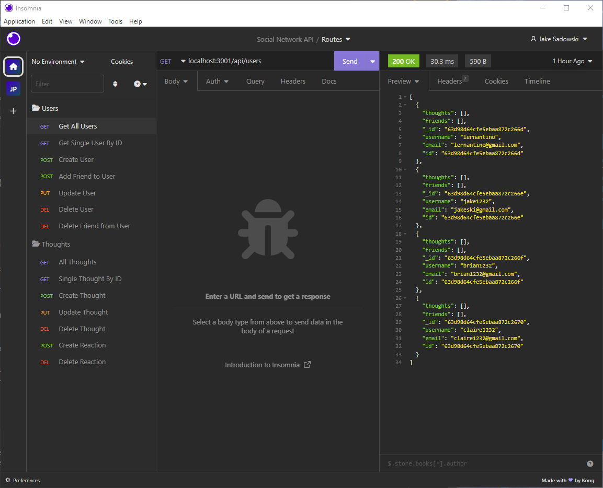
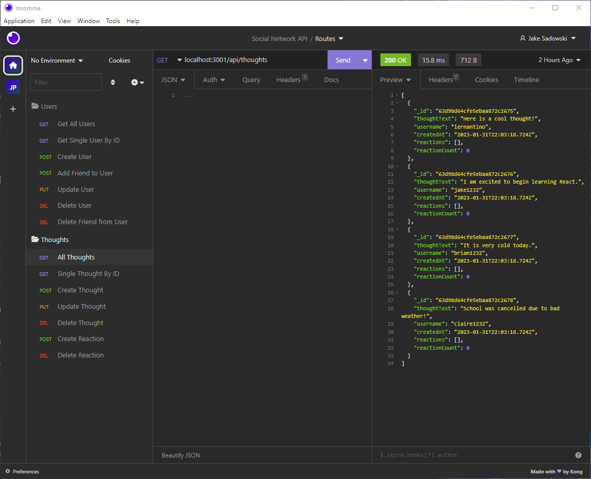

# Module 18 Social Network API

## Table of Contents
1. [Description](#description)
2. [Installation](#installation)
3. [Testing](#testing)
4. [Contribution](#contribution)
5. [Walkthrough-Video](#walkthrough-video)
6. [Mock-Up](#mock-Up)
7. [Application](#application)
8. [License](#license)
9. [Contact](#contact)

## Description
For this application, we were tasked with building an API for a social network web application where users can share their thoughts, react to other's thoughts, and create a friend list. 

This application uses Express.js for routing, a MongoDB database, and the Mongoose ODM.

## Installation
Install dependencies using ``` npm i ``` and check to make sure Express, MongoDB, and Mongoose are installed. Next, navigate to the terminal and run the command ``` node utils/seed ``` to seed the database, followed by ``` node index.js ``` to start the server.

## Testing
No tests written for this project!

## Contribution
Currently not accepting contributions to the repo.

## Walkthrough Video
:


## Mock-Up
()

()

## License
Please see https://mit-license.org/ to get info about this license


## Contact
GitHub: https://www.github.com/jsadowski7
LinkedIn: https://www.linkedin.com/in/jake-sadowski-6b9385255/